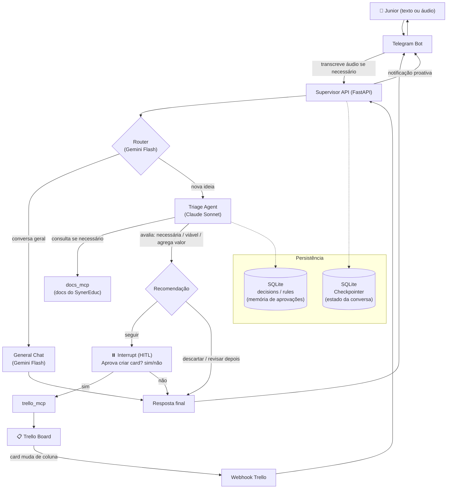

# personal-agent-system

Sistema pessoal multiagente, construído com LangGraph e MCP, para captar ideias por voz ou texto no Telegram, avaliá-las automaticamente e transformar as boas ideias em cards no Trello — com supervisão humana no loop.

## O que é

Este projeto nasceu como um exercício prático de **AI Agent Engineering**: aprender LangGraph, MCP (Model Context Protocol), orquestração multiagente e human-in-the-loop construindo algo que eu (Junior) uso de verdade no meu dia a dia, antes de aplicar os mesmos conceitos em produção no [SynerEduc](https://github.com/jjsjunior3/SynerEduc-P), meu SaaS de gestão escolar.

A ideia central: eu falo ou escrevo uma ideia no Telegram, um agente supervisor decide se é uma conversa comum ou uma ideia de produto/projeto, e — se for uma ideia — um agente de triagem investiga (consultando inclusive a documentação real do SynerEduc via MCP), avalia se ela é necessária, viável e se agrega valor, e só cria o card no Trello depois da minha aprovação.

## Arquitetura

## Stack

| Camada | Tecnologia |
|---|---|
| Orquestração de agentes | LangGraph (StateGraph, interrupt/Command para HITL) |
| Integração com ferramentas | MCP (Model Context Protocol) via FastMCP + langchain-mcp-adapters |
| API | FastAPI (async) |
| LLM de roteamento e conversa geral | Gemini 2.5 Flash (via OpenRouter) |
| LLM de triagem/decisão | Claude Sonnet (Anthropic, structured output) |
| Interface | Telegram Bot (texto e áudio, com transcrição via OpenAI) |
| Persistência | SQLite (checkpointer do LangGraph + memória de decisões/regras) |
| Infraestrutura | Docker Compose (multi-serviço, healthchecks) |
| Exposição local | Cloudflare Tunnel (webhooks do Trello) |

## Status do projeto (v1)

- [x] Fase 0 — Fundação: Docker Compose, FastAPI, bot do Telegram, persistência de conversa
- [x] Fase 1 — Roteamento condicional (conversa geral x triagem) com structured output
- [x] Fase 2 — Agente de triagem com Claude Sonnet e análise estruturada (necessária/viável/agrega valor)
- [x] Fase 3 — Criação de card no Trello via MCP quando a recomendação é "seguir"
- [x] Fase 4 — Human-in-the-loop: interrupt do LangGraph pedindo aprovação (sim/não) antes de criar o card
- [x] Fase 4.5 — Suporte a mensagens de voz no Telegram (transcrição automática)
- [x] Fase 5 — Agente de triagem consulta a documentação real do SynerEduc via MCP (grounding nas decisões já tomadas)
- [x] Fase 6 — Notificações proativas: webhook do Trello avisa no Telegram quando um card muda de coluna
- [x] Fase 7 — Memória de decisões: o sistema aprende quando eu aprovo repetidamente o mesmo tipo de ação e oferece auto-aprovação
- [ ] Fase 8 — Novos agentes especializados (código/GitHub, documentos/Drive)
- [ ] Fase 9 — Busca na web
- [ ] Fase 10 — Interface web (AG-UI)
- [ ] Fase 11 — Deploy em produção (domínio fixo, Postgres gerenciado)

## Aprendizado

Cada fase deste projeto foi implementada e depurada por mim, linha por linha — o objetivo não é só ter o sistema funcionando, mas entender profundamente cada decisão de engenharia por trás dele: por que usar `AsyncSqliteSaver` em vez de `SqliteSaver`, por que `interrupt()` pausa a execução de verdade em vez de simular uma confirmação, por que a validação de sim/não é determinística e não feita por LLM, como o MCP conecta agentes a ferramentas externas de forma padronizada.

Esse projeto também dialoga diretamente com tendências atuais de IA em produção (agentes conectados a ferramentas via protocolos como MCP, humano no loop, grounding em documentação real) — discutidas, por exemplo, no relatório "AI Trends 2026" do Google Cloud.

---

Projeto pessoal de [Junior](https://github.com/jjsjunior3) — desenvolvedor e fundador do [SynerEduc](https://github.com/jjsjunior3/SynerEduc-P).
